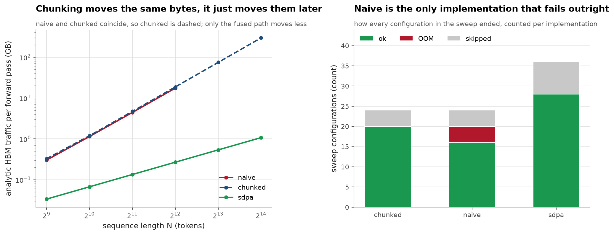
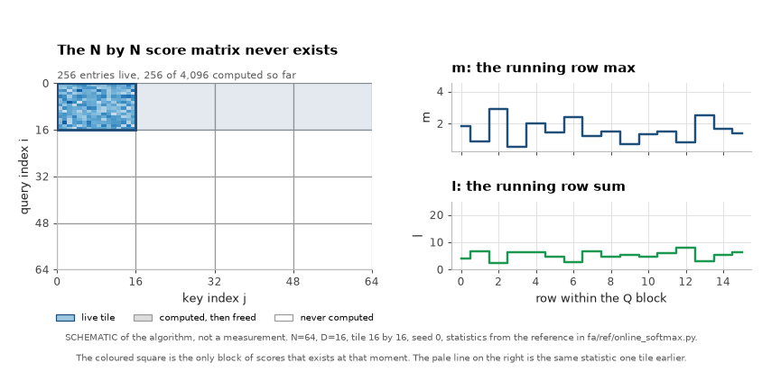
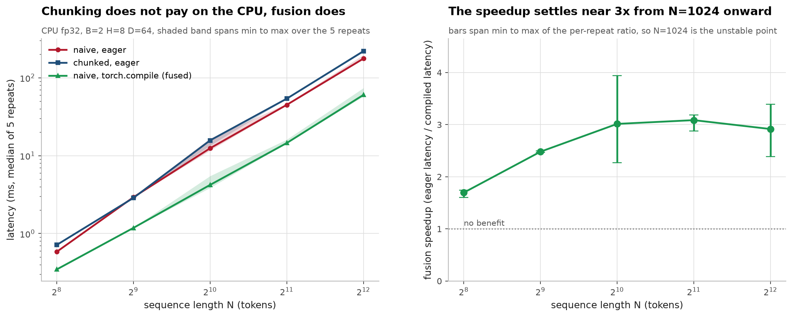
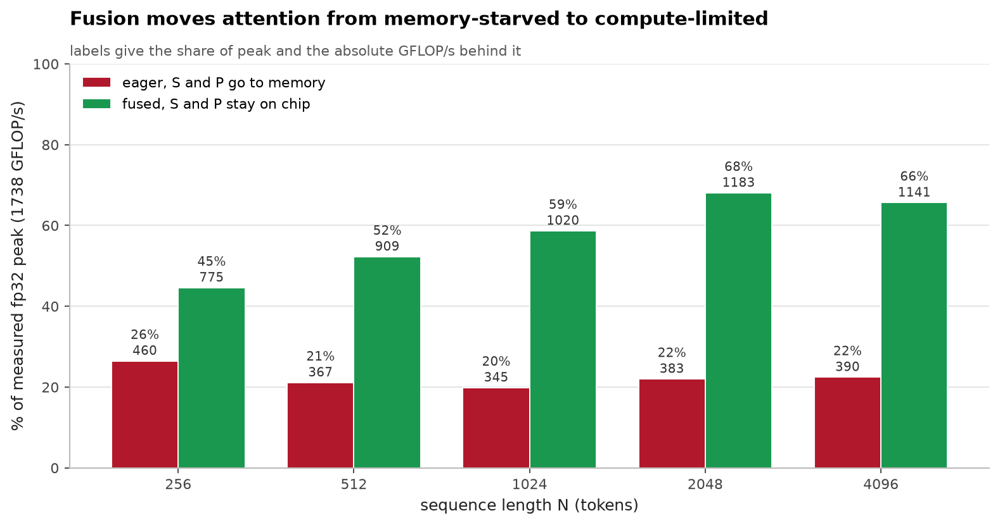
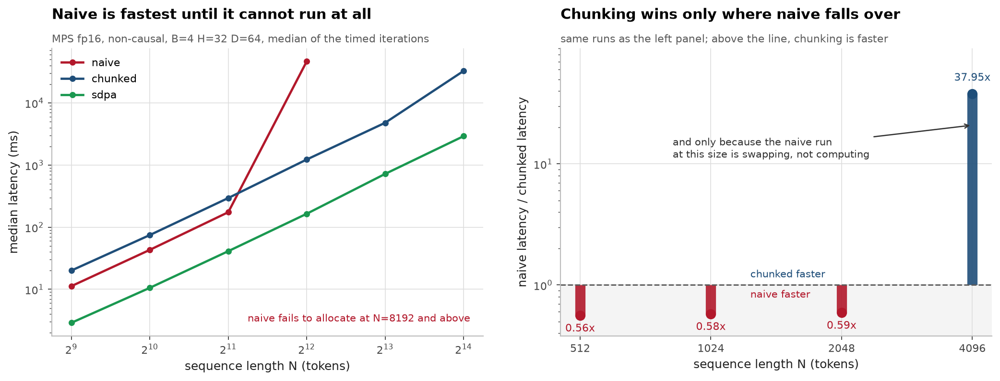
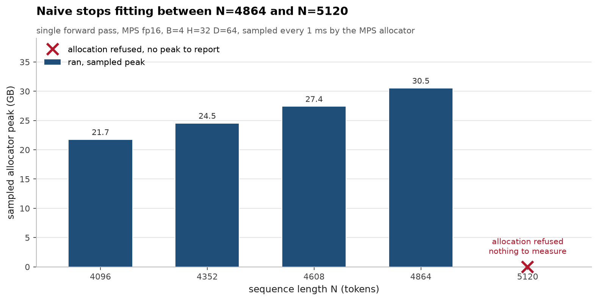
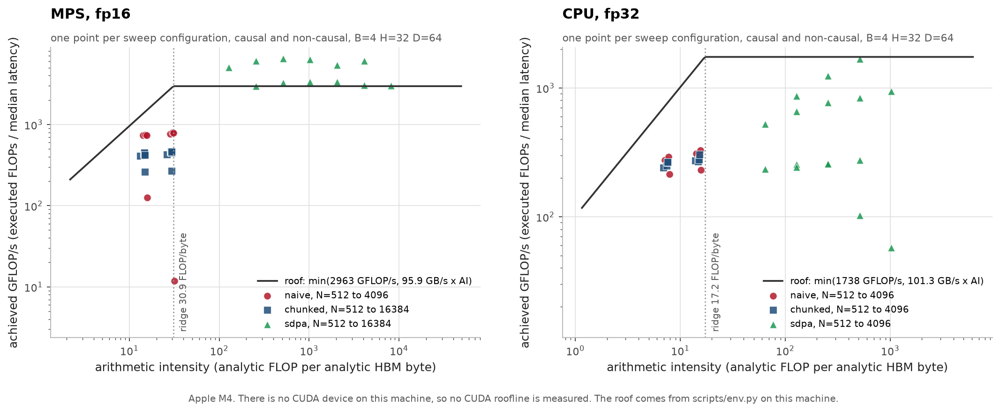
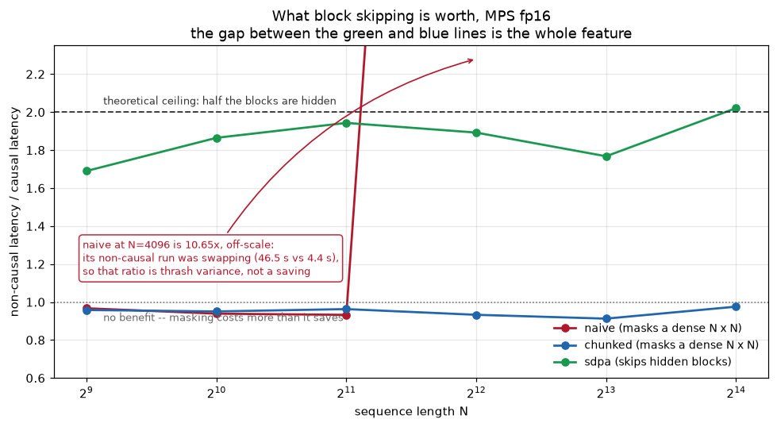
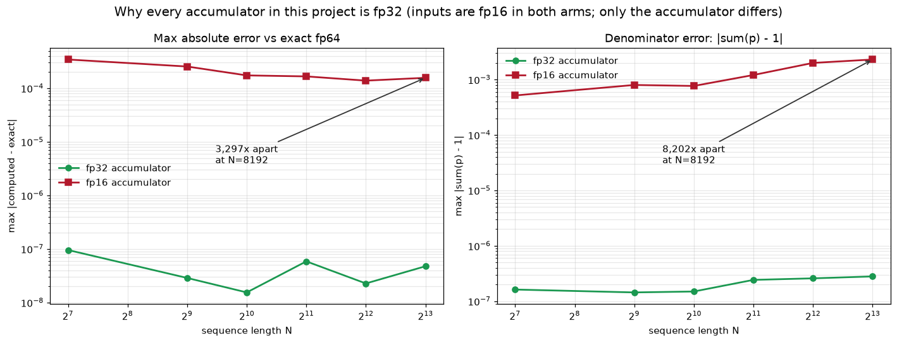

# flash-attention-from-scratch

[](https://github.com/aghasalim/flash-attention-from-scratch/actions/workflows/ci.yml)
[](https://www.python.org/)
[](LICENSE)
[](results/)

A from-scratch implementation of IO-aware attention, built to check whether the
standard claim about it, that attention is bound by memory bandwidth rather than
arithmetic, actually holds on hardware I can measure.

**Current state.** The mathematics, the reference implementations, the test suite
and the empirical analysis are complete and reproducible. The Triton and CUDA
kernels are not written. Triton publishes no macOS wheel and this machine has no
NVIDIA GPU, so six of the twelve planned tasks are blocked on hardware rather than
on effort. I have not written kernels I cannot compile or test; the repository
holds no unverified kernel code, and every quantity that could not be measured
here says so explicitly rather than being estimated or taken from the literature.

---

## 1. The question

Attention computes `S = QKᵀ/√d`, `P = softmax(S)`, `O = PV`. The cost is supposed to
be dominated not by the two matmuls but by writing the `B·H·N²` score matrix to
memory and reading it back, an intermediate the caller never asked for.

The ratio of score traffic to parameter traffic is `N/D`, so at `D = 64` the scores
overtake `Q`, `K`, `V` and `O` combined at `N = 64`:

| N | Q,K,V,O | S,P | ratio |
|---:|---:|---:|---:|
| 1024 | 0.062 GiB | 0.500 GiB | 8× |
| 4096 | 0.250 GiB | 8.000 GiB | 32× |
| 16384 | 1.000 GiB | 128.000 GiB | 128× |

fp16, `B=4 H=32 D=64`. The argument is clearly right in the limit; what I wanted was
a number for how much it is worth on a machine I own.



*Left: analytic traffic. Naive and chunked lie on top of each other, since chunking
changes when the bytes move, not how many. Right: naive is the only implementation
that fails outright, on 4 of 24 configurations.*

The way out is to never build `S` at all. The scores are computed one tile at a time,
and the only state carried from one tile to the next is a running row max `m` and a
running row sum `l`, two floats per query row. That is the whole trick, and it is
easier to watch than to read:



*Schematic of the algorithm, not a measurement. Non-causal, N=64, D=16, tile 16 by 16,
seed 0, traced through the reference in
[fa/ref/online_softmax.py](fa/ref/online_softmax.py). Only the coloured block of scores
exists at each step: grey blocks were computed and freed, white ones have not been
touched. Every other figure on this page is measured data.*

## 2. What I found
**Fusion is worth roughly 3× on this hardware, and it takes achieved throughput from 22% of the CPU's measured fp32 peak to roughly 67%.** This is the central result and it is measured rather than modelled.









Full detail in [notes/METHODS.md](notes/METHODS.md#2-what-i-found).
## 3. What is measured, and what is not
Hardware fingerprint via `scripts/env.py`, which has a full NVIDIA code path that finds nothing here and says so.

Full detail in [notes/METHODS.md](notes/METHODS.md#3-what-is-measured-and-what-is-not).
## 4. Reproducing

```bash
python -m venv .venv && source .venv/bin/activate
pip install -e ".[dev]"
```

```bash
python -m scripts.env          # hardware fingerprint -> HARDWARE.md, hardware.json
python -m pytest tests/        # 270 passed, 38 skipped, 192 xfailed (~11 s)
python -m fa.ref.online_softmax  # exactness proof and the accumulator experiments
python -m bench.fusion         # CPU fusion measurement -> results/fusion.csv (~5 min)
python -m bench.roofline       # full sweep -> results/roofline.csv (~14 min)
python -m bench.figures        # every figure above, drawn from the committed CSVs
python scripts/check_numbers.py  # every figure above, re-derived from source data
```

The 192 expected failures are the kernel tests. They are written and will run
against a Triton implementation the day there is a GPU; they are marked `xfail` for
want of hardware, not for want of a test.

`scripts/check_numbers.py` re-derives 23 of the figures in this file from
`hardware.json` and `results/*.csv` and fails if they disagree. It runs in CI on
every push, because prose goes stale when the underlying data is regenerated rather
than when the prose is edited, which is precisely how the ridge-point error above
survived for several hours.

## 5. Method and structure
The work is organised into waves, each one verifiable on its own before the next depends on it.

Full detail in [notes/METHODS.md](notes/METHODS.md#5-method-and-structure).
## 6. Limitations

The kernel, the object the project is named after, does not exist. Everything here
is baselines, references, harness and analysis.

Every measurement is Apple silicon. Unified memory has a compute-to-bandwidth ratio
unlike any discrete GPU, and while the shape of these results should transfer, no
individual number will. In particular the roofline verdict for the unfused baselines
is indeterminate here and would likely be decisive on a discrete card, where the
ridge point sits far higher.

The fusion measurement in §2 is inductor's C++ code generation, not FlashAttention.
There is no tiling, no online softmax, no explicit shared-memory blocking, and it
still allocates `O(N²)`, so it does not address the memory wall, only the traffic.
It establishes that the mechanism is real and worth measuring; it is not a
substitute for the kernel and should not be quoted as one.

`sdpa_kernel` is a silent no-op on MPS. Forcing a backend there does nothing and
raises no error; those rows are labelled `NOT HONORED` in the CSV rather than
reported as a MATH-backend measurement. On the CPU the same probe behaves correctly.

The backward pass is derived on paper and never executed.

## 7. Errors worth recording
Five, in descending order of how much they should have embarrassed me.

Full detail in [notes/METHODS.md](notes/METHODS.md#7-errors-worth-recording).
## 8. References

Each paper is listed because the implementation follows it, not as background reading.

- **Milakov, Gimelshein. Online normalizer calculation for softmax. 2018.** [arXiv:1805.02867](https://arxiv.org/abs/1805.02867) The two page result the whole construction rests on.
- **Rabe, Staats. Self-attention Does Not Need O(n^2) Memory. 2021.** [arXiv:2112.05682](https://arxiv.org/abs/2112.05682) The memory result without the IO framing. `chunked_attention` here is essentially their construction, and section 2 measures why that is not sufficient on its own.
- **Dao, Fu, Ermon, Rudra, Ré. FlashAttention: Fast and Memory-Efficient Exact Attention with IO-Awareness. NeurIPS 2022.** [arXiv:2205.14135](https://arxiv.org/abs/2205.14135) The IO-awareness that makes the difference, with the complexity argument in its section 3.2.
- **Dao. FlashAttention-2: Faster Attention with Better Parallelism and Work Partitioning. 2023.** [arXiv:2307.08691](https://arxiv.org/abs/2307.08691) Work partitioning, and the loop ordering the NumPy reference is written in.
- **Shah, Bikshandi, Zhang et al. FlashAttention-3: Fast and Accurate Attention with Asynchrony and Low-precision. NeurIPS 2024.** [arXiv:2407.08608](https://arxiv.org/abs/2407.08608) Hopper warp specialisation and FP8. Out of reach without that hardware, and not measured here.
- **Kwon, Li, Zhuang et al. Efficient Memory Management for Large Language Model Serving with PagedAttention. SOSP 2023.** [arXiv:2309.06180](https://arxiv.org/abs/2309.06180) The block table design behind the paged cache task.

## Author

Aghasalim Mustafazada, third year AI student at Howest, Belgium.

<p align="center">
  <a href="https://github.com/aghasalim">
    </a>
  <a href="https://www.kaggle.com/aghasalimmustafazada">
    </a>
  <a href="https://linkedin.com/in/mustafazada">
    </a>
  <a href="https://orcid.org/0009-0001-8746-4582">
    </a>
</p>

## License

MIT, see [LICENSE](LICENSE).
