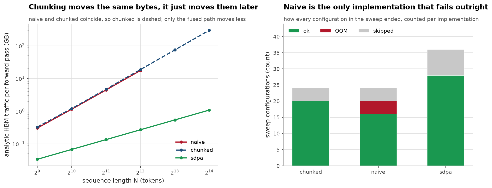
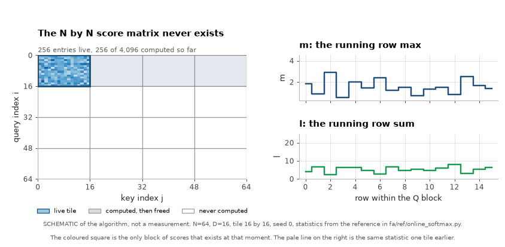
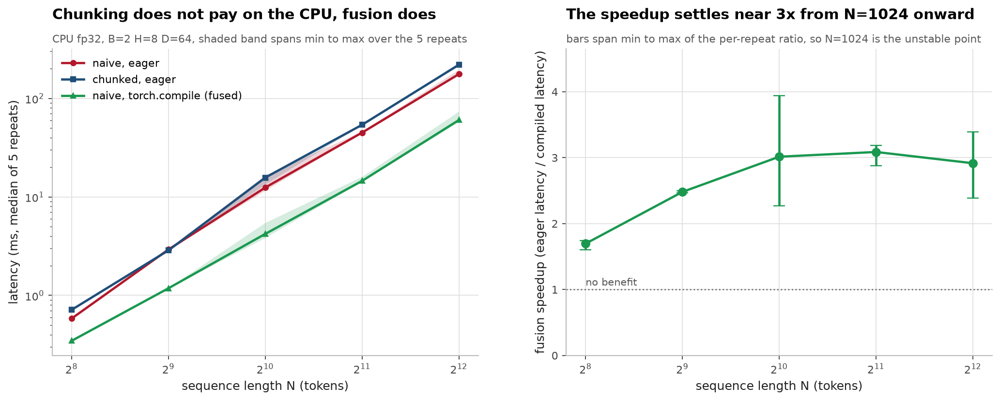
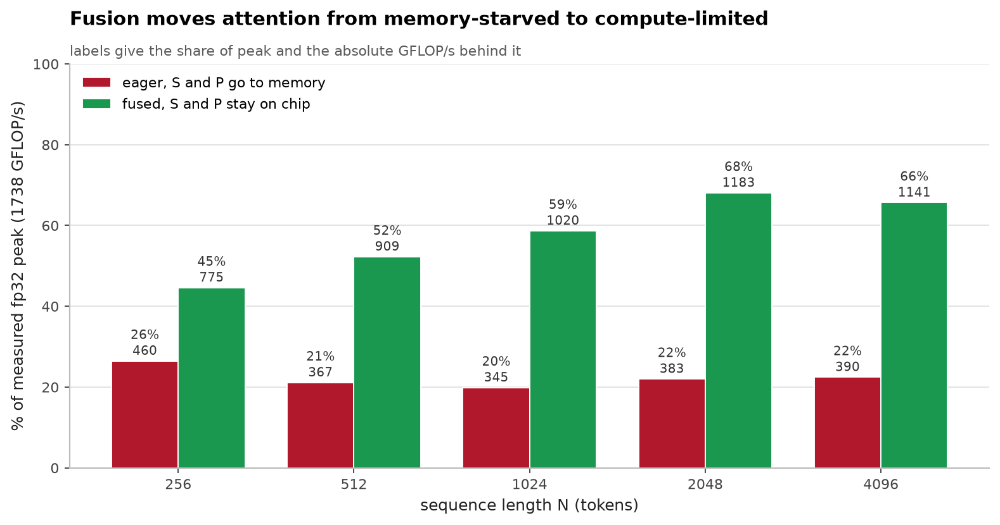
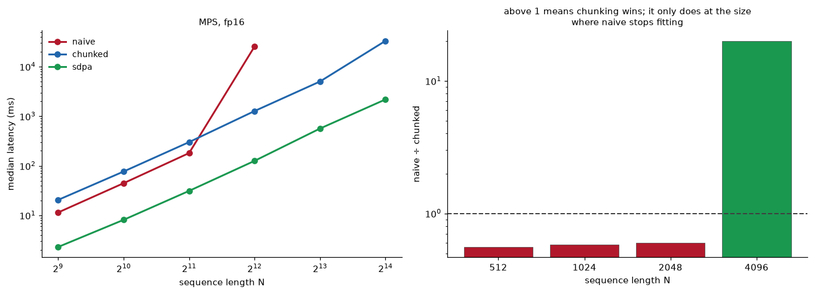
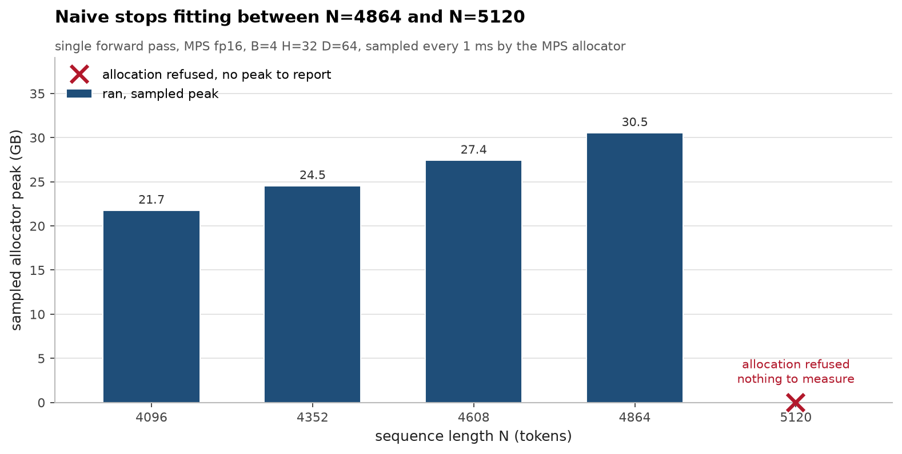
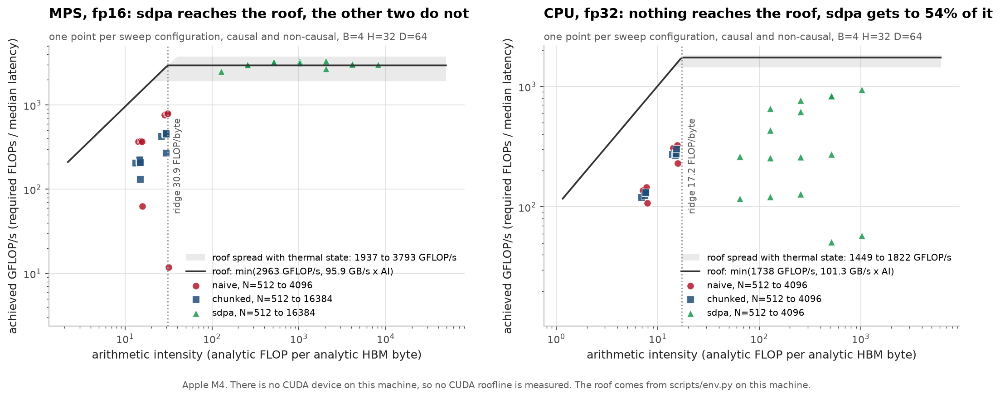
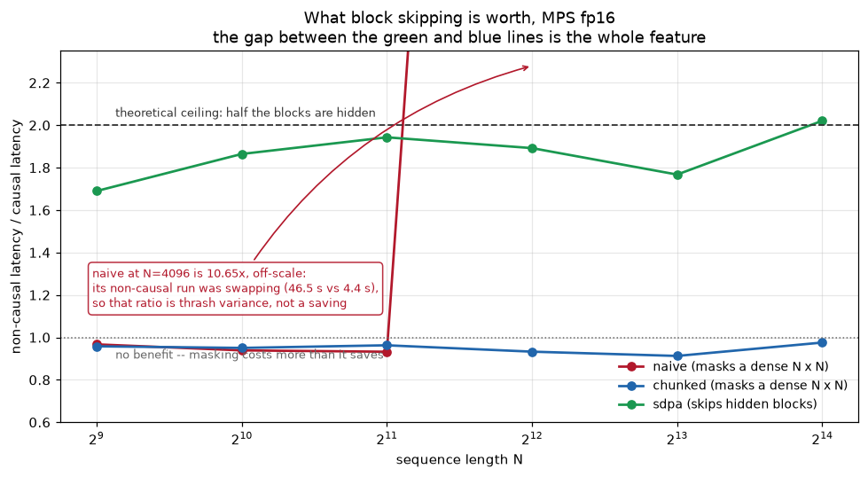
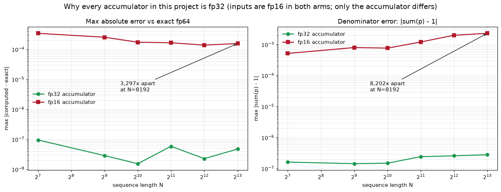

# flash-attention-from-scratch

[](https://github.com/aghasalim/flash-attention-from-scratch/actions/workflows/ci.yml)
[](https://www.python.org/)
[](LICENSE)
[](results/)
[](https://doi.org/10.5281/zenodo.23003627)

I implemented IO-aware attention from scratch because I wanted to check a claim
I kept reading. People say attention is limited by memory bandwidth rather than
arithmetic, and I wanted to see if that holds on hardware I can measure myself.

Where it stands right now: the maths, reference implementations, test suite and
measurements are done and reproducible. I haven't written the Triton and CUDA
kernels yet. Triton has no macOS wheel and my machine has no NVIDIA GPU, so six
of the twelve tasks I planned are waiting on hardware. I didn't want to commit
kernels I can't compile or test, so there's no unverified kernel code in here.
Anything I couldn't measure is marked as not measured.

---

## 1. The question

Attention computes `S = QKᵀ/√d`, `P = softmax(S)`, `O = PV`. The usual story is
that the two matmuls aren't the expensive part. Most of the cost comes from
writing the `B·H·N²` score matrix to memory and reading it back, and the caller
never even needs that matrix.

Score traffic over parameter traffic is `N/D`. At `D = 64` the scores move more
bytes than `Q`, `K`, `V` and `O` together once `N = 64`.

| N | Q,K,V,O | S,P | ratio |
|---:|---:|---:|---:|
| 1024 | 0.062 GiB | 1.000 GiB | 16× |
| 4096 | 0.250 GiB | 16.000 GiB | 64× |
| 16384 | 1.000 GiB | 256.000 GiB | 256× |

fp16, `B=4 H=32 D=64`. In the limit the argument is obviously right. I wanted to
know how much it's actually worth on a machine I own.



*Left: analytic traffic. Naive and chunked sit on top of each other, because
chunking changes when the bytes move but doesn't change how many there are. Right:
naive is the only implementation that fails outright, on 4 of 24 configurations.*

The fix is to never build `S`. You compute the scores one tile at a time and only
carry a running row max `m` and a running row sum `l` from tile to tile, which is
two floats per query row. I found it easier to understand by watching it.



*This one is a diagram of the algorithm and isn't measured. Non-causal, N=64, D=16, tile 16 by 16,
seed 0, traced through the reference in
[fa/ref/online_softmax.py](fa/ref/online_softmax.py). At each step only the coloured
block of scores exists. Grey blocks were computed and freed, and white ones haven't
been touched yet. Every other figure on this page is measured data.*

## 2. What I found
On this hardware fusion is worth roughly 3×. It takes achieved throughput from 22% of the CPU's measured fp32 peak to roughly 67%. That's the main result, and I measured it.

Tiling by itself didn't help at all. Chunked attention runs at 0.56 to 0.59× naive on
the GPU. Its arithmetic intensity is 29.47 against naive's 31.51, so looping over
key blocks without fusing actually pushes intensity down.

The memory wall turned out to be very sudden. Naive attention follows `N²` up to
2048, where it takes 174 ms. Then it takes 46.5 s at `N = 4096`, a 267× jump for 4×
the work. A fitted `N²` trend would have predicted 679 ms. At that size chunked
attention is 37.95× faster, and it still runs at 16384.

Causal masking only helps when blocks actually get skipped. The SDPA path that
skips them gets 2.02×. The implementations that mask a dense `N×N` get 0.91 to 0.98×.
Last, fp32 accumulators cut maximum absolute error by a factor of 3297 at `N = 8192`.









Full detail in [notes/METHODS.md](notes/METHODS.md#2-what-i-found).
## 3. What is measured, and what is not
I take the hardware fingerprint with `scripts/env.py`. It has a full NVIDIA code path too, which finds nothing on this machine and reports that.

Every number on this page comes from an Apple M4 with 10 GPU cores and 25.77 GB of
unified memory. I measured 95.86 GB/s copy bandwidth on MPS and 101.29 GB/s on the
CPU. Matmul peaks were 2963.5 GFLOP/s fp16 on MPS and 1738.3 GFLOP/s fp32 on the CPU.
There's no CUDA device and no macOS Triton wheel, so HBM bandwidth, tensor-core
throughput, SM count, `cp.async`, FP8 and TMA are all recorded as not measured on this hardware. MPS also has no float64, so
the fp64 reference runs on the CPU. The same matmul varies enough from run to run
to change a conclusion, so I report every figure as a median with its range.

Full detail in [notes/METHODS.md](notes/METHODS.md#3-what-is-measured-and-what-is-not).
## 4. Reproducing

```bash
python -m venv .venv && source .venv/bin/activate
pip install -e ".[dev]"
```

```bash
python -m scripts.env          # hardware fingerprint -> HARDWARE.md, hardware.json
python -m pytest tests/        # 270 passed, 38 skipped, 192 xfailed (~11 s)
python -m fa.ref.online_softmax  # exactness proof and the accumulator experiments
python -m bench.fusion         # CPU fusion measurement -> results/fusion.csv (~5 min)
python -m bench.roofline       # full sweep -> results/roofline.csv (~14 min)
python -m bench.figures        # every figure above, drawn from the committed CSVs
python scripts/check_numbers.py  # every figure above, re-derived from source data
```

The 192 expected failures are the kernel tests. I've written them, and they'll run
against a Triton implementation once I have a GPU. Until then they're marked `xfail`.

`scripts/check_numbers.py` re-derives 34 quoted figures from `hardware.json` and
`results/*.csv` and fails if the text and the data disagree. It reads this file and
the notes together, since most of the detail is in `notes/METHODS.md` now. It runs
in CI on every push. Text goes stale when the data under it is regenerated and
nobody updates the wording, and that's how the ridge-point error survived for several hours. Separately, `verify/` recomputes every
published number a different way, starting from the rawest data in the repo, and
CI fails if any of them disagrees.

## 5. Method and structure
I split the work into stages, and I check each one on its own before the next one builds on it.

`fa/ref/` has the fp64 ground truth, the naive, chunked and backend-forced SDPA
baselines, and the NumPy online-softmax reference, written in the same shape the
Triton kernel will have. `fa/triton/` and `fa/cuda/` are empty. `make gpu` rents one
NVIDIA card on RunPod and runs the suite there with Triton installed. On an RTX
3090 it gives 270 passed, 38 skipped and 192 xfailed, which is right while the
kernel doesn't exist. The
suite is 500 tests, 192 of them xfail pending a GPU. I wrote it against the
references before any kernel existed, because a harness written afterwards tends
to treat the kernel's own bugs as expected behaviour. For correctness I use a
relative bar. A kernel's error against the fp64 reference can't be more than twice
the naive implementation's error against that same reference.

Full detail in [notes/METHODS.md](notes/METHODS.md#5-method-and-structure).
## 6. Limitations

The kernel the project is named after doesn't exist yet. What's here is
baselines, references, the test harness and analysis.

All the measurements are on Apple silicon. Unified memory has a compute to
bandwidth ratio that no discrete GPU has. I'd expect the overall shape of these
results to carry over, but not any single number. In particular, the roofline
verdict for the unfused baselines is unclear here, and on a discrete card, where
the ridge point is much higher, it would probably be clear.

The fusion measurement in §2 is inductor's C++ code generation. It isn't
FlashAttention. It has no tiling, no online softmax and no explicit shared-memory
blocking, and it still allocates `O(N²)`. So it reduces traffic but doesn't get
past the memory wall. It shows the mechanism is real and worth measuring, but it
doesn't replace the kernel and shouldn't be quoted as if it did.

`sdpa_kernel` silently does nothing on MPS. Forcing a backend there has no effect
and raises no error. I labelled those rows `NOT HONORED` in the CSV so nobody reads them as MATH-backend measurements. On the CPU the same probe works correctly.

I derived the backward pass on paper but never ran it.

## 7. Errors worth recording
I made five, listed here starting with the most embarrassing.

Twice I reported a trend from single runs and had to take it back. The fusion
speedup looked like a clean climb to 4.47× until five repeats flattened it near 3×.
I also called attention memory-bound from one ridge point, before I noticed that its
band, 20.08 to 40.55, includes naive's arithmetic intensity of 31.51.

My out-of-memory prediction was off by 19.2%. The textbook model counts two `N²`
tensors, but the real one holds 3.16, because of the extra `masked_fill`
intermediate. With three tensors the prediction lands 2.7% under the measured
failure. I also expected tiling to be the big win, and it came out at 0.56×. And I
trusted `sdpa_kernel` without checking that it was honoured, which on MPS it isn't.

The checks in `verify/` caught two more. The §1 traffic table only counted half
the score traffic it claimed to, and §2 described a measurement as a trend
prediction.

Full detail in [notes/METHODS.md](notes/METHODS.md#7-errors-worth-recording).
## 8. References

I listed each paper because the implementation follows it.

- **Milakov, Gimelshein. Online normalizer calculation for softmax. 2018.** [arXiv:1805.02867](https://arxiv.org/abs/1805.02867) The two page result the whole construction rests on.
- **Rabe, Staats. Self-attention Does Not Need O(n^2) Memory. 2021.** [arXiv:2112.05682](https://arxiv.org/abs/2112.05682) The memory result without the IO framing. `chunked_attention` here is essentially their construction, and section 2 measures why that is not sufficient on its own.
- **Dao, Fu, Ermon, Rudra, Ré. FlashAttention: Fast and Memory-Efficient Exact Attention with IO-Awareness. NeurIPS 2022.** [arXiv:2205.14135](https://arxiv.org/abs/2205.14135) The IO-awareness that makes the difference, with the complexity argument in its section 3.2.
- **Dao. FlashAttention-2: Faster Attention with Better Parallelism and Work Partitioning. 2023.** [arXiv:2307.08691](https://arxiv.org/abs/2307.08691) Work partitioning, and the loop ordering the NumPy reference is written in.
- **Shah, Bikshandi, Zhang et al. FlashAttention-3: Fast and Accurate Attention with Asynchrony and Low-precision. NeurIPS 2024.** [arXiv:2407.08608](https://arxiv.org/abs/2407.08608) Hopper warp specialisation and FP8. Out of reach without that hardware, and not measured here.
- **Kwon, Li, Zhuang et al. Efficient Memory Management for Large Language Model Serving with PagedAttention. SOSP 2023.** [arXiv:2309.06180](https://arxiv.org/abs/2309.06180) The block table design behind the paged cache task.


## License

MIT, see [LICENSE](LICENSE).
